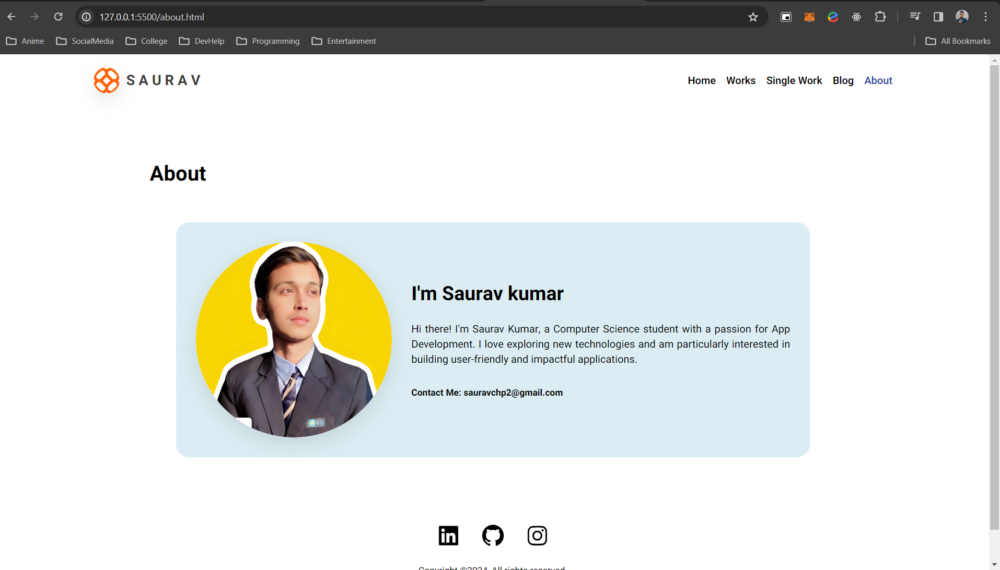

# PortfolioHub

PortfolioHub is a comprehensive portfolio website template designed to showcase your projects, skills, and experiences in a professional and visually appealing manner.

## Features

- **Homepage:** Introduce yourself and provide a brief overview of your expertise and aspirations.
- **Projects:** Display your projects with captivating images, detailed descriptions, and links to live demos or repositories.
- **Skills:** Highlight your technical skills, tools, and technologies using interactive charts or visually appealing layouts.
- **Experience:** Share your work experience, education, certifications, and any relevant achievements.
- **Contact:** Enable visitors to get in touch with you easily through email, social media links, or a contact form.

